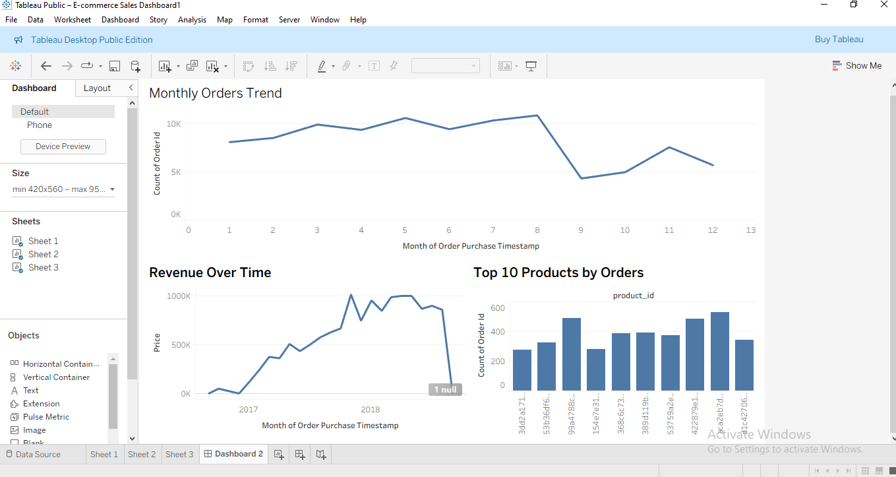

# 📊 E-Commerce Sales Analysis & Dashboard (Data Analyst Project)

## 📌 Overview
This project focuses on analyzing an E-commerce dataset to generate meaningful business insights using SQL and Tableau.  
The goal is to understand sales trends, product performance, and customer behavior.

---

## 🎯 Objectives
- Analyze order and sales trends  
- Identify top-performing products  
- Calculate total revenue  
- Understand customer order patterns  
- Build an interactive dashboard  

---

## 🛠 Tools & Technologies
- Excel – Data understanding  
- SQL (SSMS) – Data querying & analysis  
- Tableau – Data visualization & dashboard creation  

---

## 📂 Project Workflow

### 🔹 1. Data Collection
- Downloaded E-commerce dataset from Kaggle  
- Extracted ZIP file  

---

### 🔹 2. Data Understanding (Excel)
- Opened datasets in Excel  
- Explored tables and columns  
- Identified common columns to understand relationships between tables  

---

### 🔹 3. Data Analysis (SQL)
- Imported data into SQL Server  
- Performed analysis using SQL queries:
  - Data exploration using SELECT  
  - Total rows using COUNT  
  - Total revenue using SUM  
  - Top products using GROUP BY  
  - Customer analysis  
  - JOIN operations to combine tables using `order_id`  
  - Monthly trend analysis using date functions  

📁 SQL Queries File: `ecommercesql.sql`

---

### 🔹 4. Data Modeling & Visualization (Tableau)
- Connected multiple tables using JOIN in Tableau  
- Built relationships between datasets  
- Created visualizations:
  - Monthly Orders Trend  
  - Revenue Over Time  
  - Top 10 Products by Orders  
- Combined all charts into an interactive dashboard  

---

## 📊 Dashboard Preview

---

## 📈 Key Insights
- Monthly order trends show variations over time  
- Revenue patterns observed across different months  
- Top 10 products contribute significantly to total sales  
- Customer purchasing behavior analyzed  

---

## 🚀 Conclusion
This project demonstrates the complete data analysis workflow — from data understanding and SQL-based analysis to building an interactive Tableau dashboard.
